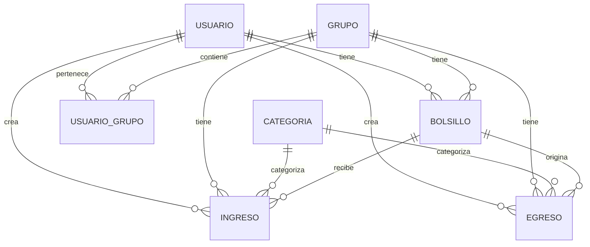

# Arquitectura del Sistema

Esta documentación describe la arquitectura técnica de FinanzApp.

## 📐 Visión General

FinanzApp sigue una arquitectura **Cliente-Servidor** con separación clara entre frontend y backend.

```
┌─────────────────┐         HTTP/REST API        ┌─────────────────┐
│                 │◄──────────────────────────────│                 │
│  React Frontend │                               │ Django Backend  │
│   (Port 3000)   │──────────────────────────────►│   (Port 8000)   │
│                 │       JSON Responses          │                 │
└─────────────────┘                               └────────┬────────┘
                                                           │
                                                           ▼
                                                  ┌─────────────────┐
                                                  │  SQLite Database│
                                                  └─────────────────┘
```

## 🗂️ Capas del Sistema

### 1. Capa de Presentación (Frontend)

#### Tecnologías
- **React 18**: Biblioteca de UI
- **Vite**: Build tool y dev server
- **Tailwind CSS**: Framework de estilos
- **React Router**: Navegación SPA
- **Axios**: Cliente HTTP

#### Estructura de Componentes

```
src/
├── components/          # Componentes reutilizables
│   ├── Header.jsx      # Navegación principal
│   ├── Sidebar.jsx     # Menú lateral
│   ├── BackendStatus.jsx # Monitor de backend
│   └── ...
├── pages/              # Páginas/Vistas
│   ├── Dashboard.jsx   # Panel principal
│   ├── Transactions.jsx # Gestión de transacciones
│   ├── Groups.jsx      # Gestión de grupos
│   └── ...
├── context/            # Estado global
│   ├── AuthContext.jsx # Autenticación
│   └── GroupContext.jsx # Grupos activos
├── services/           # Comunicación API
│   ├── api.js         # Configuración Axios
│   ├── auth.js        # Servicios de auth
│   └── ...
└── utils/             # Utilidades
```

#### Flujo de Datos

```
User Action
    ↓
Component Event
    ↓
Service API Call
    ↓
Backend Endpoint
    ↓
Response Processing
    ↓
State Update
    ↓
UI Re-render
```

### 2. Capa de Aplicación (Backend)

#### Tecnologías
- **Django 5.2.7**: Framework web
- **Django REST Framework**: API REST
- **Token Authentication**: Seguridad
- **SQLite**: Base de datos (desarrollo)

#### Estructura de la Aplicación

```
Backend_Django/
├── backend/           # Configuración del proyecto
│   ├── settings.py   # Configuración principal
│   ├── urls.py       # Enrutamiento raíz
│   └── wsgi.py       # WSGI server
└── finances/         # App principal
    ├── models.py     # Modelos de datos
    ├── serializers.py # Transformación JSON
    ├── views.py      # Lógica de negocio
    ├── urls.py       # Rutas de la app
    └── migrations/   # Cambios de BD
```

#### Patrón MVT (Model-View-Template)

```
HTTP Request
    ↓
URL Router (urls.py)
    ↓
ViewSet (views.py)
    ↓
├─► Serializer ◄─┐
│   (serializers.py) │
├─► Model          │
│   (models.py)    │
└─► Database ──────┘
    ↓
HTTP Response (JSON)
```

### 3. Capa de Datos

#### Modelo de Datos



#### Modelos Principales

**Usuario**
```python
- usuario_id (PK)
- email (unique)
- nombre
- password (hash)
- divisa_pref
```

**Grupo**
```python
- grupo_id (PK)
- nombre
- descripcion
- fecha_creacion
- creador (FK Usuario)
```

**Bolsillo**
```python
- bolsillo_id (PK)
- nombre
- saldo
- color
- usuario (FK Usuario, nullable)
- grupo (FK Grupo, nullable)
# XOR: usuario XOR grupo
```

**Ingreso/Egreso**
```python
- id (PK)
- monto
- descripcion
- fecha
- categoria (FK Categoria)
- bolsillo (FK Bolsillo)
- usuario (FK Usuario, nullable)
- grupo (FK Grupo, nullable)
- creado_por (FK Usuario)
# XOR: usuario XOR grupo
```

## 🔐 Seguridad

### Autenticación

```
1. Usuario envía credenciales
   POST /api-token-auth/
   { "username": "email", "password": "..." }

2. Backend valida y retorna token
   { "token": "abc123..." }

3. Cliente guarda token en localStorage

4. Peticiones incluyen token
   Authorization: Token abc123...

5. Backend valida token en cada request
```

### Autorización

**Niveles de Acceso:**

1. **Usuario Anónimo**: Solo registro y login
2. **Usuario Autenticado**: Gestión personal
3. **Miembro de Grupo**: Ver datos del grupo
4. **Admin de Grupo**: Gestión completa del grupo

**Validación en ViewSets:**

```python
def get_queryset(self):
    user = self.request.user
    
    # Personal: solo usuario
    if not grupo_id:
        return Model.objects.filter(
            usuario=user, 
            grupo__isnull=True
        )
    
    # Grupo: verificar membresía
    if user_in_group(user, grupo_id):
        return Model.objects.filter(
            grupo_id=grupo_id
        )
    
    return Model.objects.none()
```

## 🔄 Comunicación API

### Endpoints REST

```
GET    /api/resource/          # Listar
POST   /api/resource/          # Crear
GET    /api/resource/{id}/     # Obtener
PUT    /api/resource/{id}/     # Actualizar
DELETE /api/resource/{id}/     # Eliminar
```

### Filtrado por Contexto

```javascript
// Personal (sin grupo)
GET /api/bolsillos/

// Grupo específico
GET /api/bolsillos/?grupo_id=5
```

### Formato de Respuestas

**Éxito (200 OK):**
```json
{
  "id": 1,
  "nombre": "Ahorros",
  "saldo": 50000,
  "color": "#10b981"
}
```

**Error (400 Bad Request):**
```json
{
  "detail": "Saldo insuficiente",
  "saldo_disponible": 1000
}
```

## 📊 Flujo de Datos Completo

### Ejemplo: Crear Transacción

```
1. Usuario llena formulario en Transactions.jsx

2. onClick → service.transactions.create()

3. POST /api/ingresos/
   {
     "monto": 50000,
     "descripcion": "Salario",
     "categoria": 1,
     "bolsillo": 2,
     "fecha": "2025-11-14"
   }

4. IngresoViewSet.perform_create()
   - Valida datos
   - Actualiza saldo del bolsillo
   - Asigna usuario/grupo
   - Guarda en BD

5. Respuesta 201 Created
   {
     "id": 123,
     "monto": 50000,
     "descripcion": "Salario",
     "bolsillo": {
       "id": 2,
       "nombre": "Principal"
     },
     "creado_por_info": {
       "nombre": "Ivan",
       "email": "ivan@example.com"
     }
   }

6. Frontend actualiza estado local

7. UI se re-renderiza mostrando nueva transacción
```

## 🎨 Patrones de Diseño Utilizados

### Frontend

1. **Component Pattern**: Componentes reutilizables
2. **Context API**: Estado global compartido
3. **Service Layer**: Separación de lógica de API
4. **Custom Hooks**: Lógica reutilizable
5. **Higher-Order Components**: ProtectedRoute

### Backend

1. **MVT (Model-View-Template)**: Patrón Django
2. **ViewSets**: DRF para CRUD
3. **Serializers**: Transformación de datos
4. **Middleware**: Procesamiento de requests
5. **Signals**: Eventos post-save/pre-save

## 🚀 Escalabilidad

### Optimizaciones Actuales

- **Lazy Loading**: Componentes cargados bajo demanda
- **Memoization**: React.memo para componentes
- **Database Indexing**: Índices en campos frecuentes
- **Query Optimization**: select_related y prefetch_related

### Mejoras Futuras

- **PostgreSQL**: Migrar de SQLite para producción
- **Redis**: Cache de sesiones y queries
- **CDN**: Assets estáticos
- **Websockets**: Actualizaciones en tiempo real
- **Microservicios**: Separar lógica de grupos

## 📝 Notas Técnicas

### Restricción XOR

Los modelos Bolsillo, Ingreso y Egreso usan una restricción XOR:
- Deben pertenecer a un usuario **O** a un grupo
- No pueden pertenecer a ambos
- No pueden estar sin propietario

```python
class Meta:
    constraints = [
        CheckConstraint(
            check=(
                Q(usuario__isnull=False, grupo__isnull=True) |
                Q(usuario__isnull=True, grupo__isnull=False)
            ),
            name='xor_usuario_grupo'
        )
    ]
```

Esta arquitectura permite:
- ✅ Datos personales aislados
- ✅ Datos grupales compartidos
- ✅ Sin duplicación ni inconsistencias
